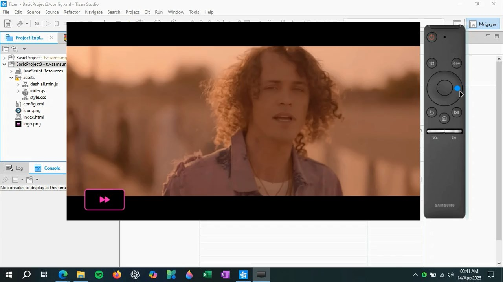
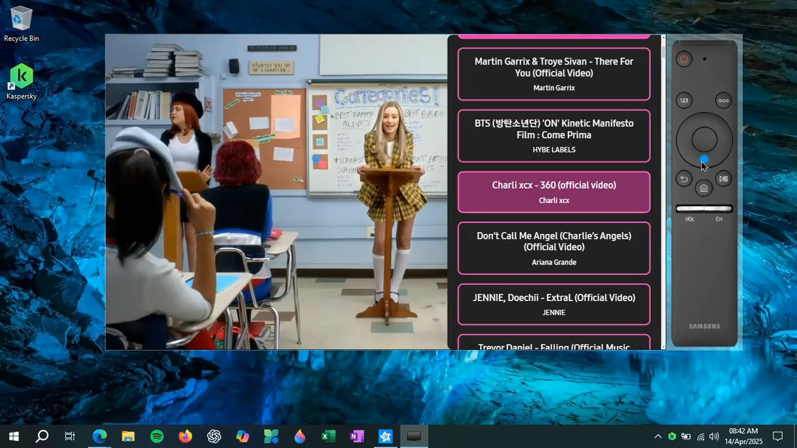
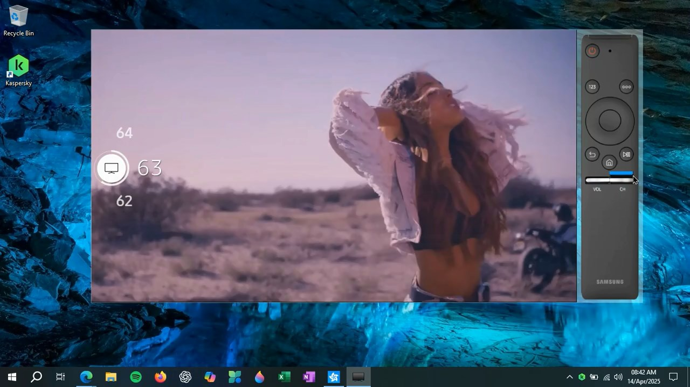

 
= ***RythmeEcho***

== Project Status

....
Completed
....

'''

== Features

. Program Made With C Using GTK For Video Downloading Interface And Mongo-C-Driver For Interacting With Mongo Database
. Uses yt-dlp To Download Video And Audio With Best Quality Available
. Videos Are Streamed Using MPEG-DASH, Known For Streaming High Quality Videos Very Efficiently
. Frontend App Is Built With Tizen SDK For Streaming On Samsung TV Using Dash.js

'''

== Technology Stack And Tools

[cols="1,1"]
|===
|Name|Version

|mongo-c-driver
|1.30.3

|GTK
|3.0

|Node.js
|23.6.0

|Tizen OS
|6.0

|Tizen Studio
|6.0

|Samsung TV Extension
|tv-samsung-9.0
|===

'''

== Install/Execute

TIP: Walkthrough Videos Are Provided Inside Docs Folder

. Setup Database
[source, bash]
sudo mongod --port 27020
. Media Preparation
.. Install The link:https://github.com/mongodb/mongo-c-driver[Mongo-C-Driver] And GTK-3 User Interface Framework.
.. Open Terminal And Execute:
[source, bash]
make
.. Download yt-dlp And Place It In #Maker# Folder. Give It Execution Permission:
[source, bash]
sudo chmod +x ./yt-dlp
.. Run Queue Processor: 
[source, bash]
nohup ./queue_processor.sh > queue_processor.log 2>&1 & 
.. Open #main# And Download Songs
. Setup Server
.. In #Backend# Folder, Install NPM Packages:
[source, bash]
npm i
.. Run Server:
[source, bash]
node server.js
. Setup Tizen TV App
.. Install Tizen Studios, Install Samsung Extension And Setup Certificate Using Your Samsung Account
.. Unlock Apps In TV By Pressing #12345# On Remote And Enter Computer IP Address
.. Open Device Manager And Connect TV With Your Computer
.. Setup A New Tizen Project And Place The Code Files In Tizen Project Folder
.. Replace #SERVER_IP# With Actual Server IP In #config.xml# And #index.js#
.. #Run As# Will Run The Code On TV
.. If Unsure, Refer To A Brief Tutorial On Youtube. Walkthrough Video May Not Be Appropriate For Actual TV

'''

== Special Note

. This Project Contains A Significant Amount Of Extra Code That Has Not Been Implemented Or Deemed Necessary
. Edge Cases Have Not Been Addressed Properly, Which Might Cause The App/Server To Crash Unexpectedly
. Walkhthrough Video For TV Is Not Appropriate, Things May Differ In Real Environment

'''

== Common Issues

.While Downloading Video, "Not Responding" Is Continuosly Prompting
[%collapsible]
====
....
This Is Common In Enviroment Such As GNOME, Either Ignore It Or Turn It Off In gsettings.
....
====

.Program Terminates Or Crashes
[%collapsible]
====
....
Follow The Walkthrough Video Step By Step
....
====

'''

== Gallery

====
****

****

****

****

****

****
====

'''

== Author

....
Mrigayan
....